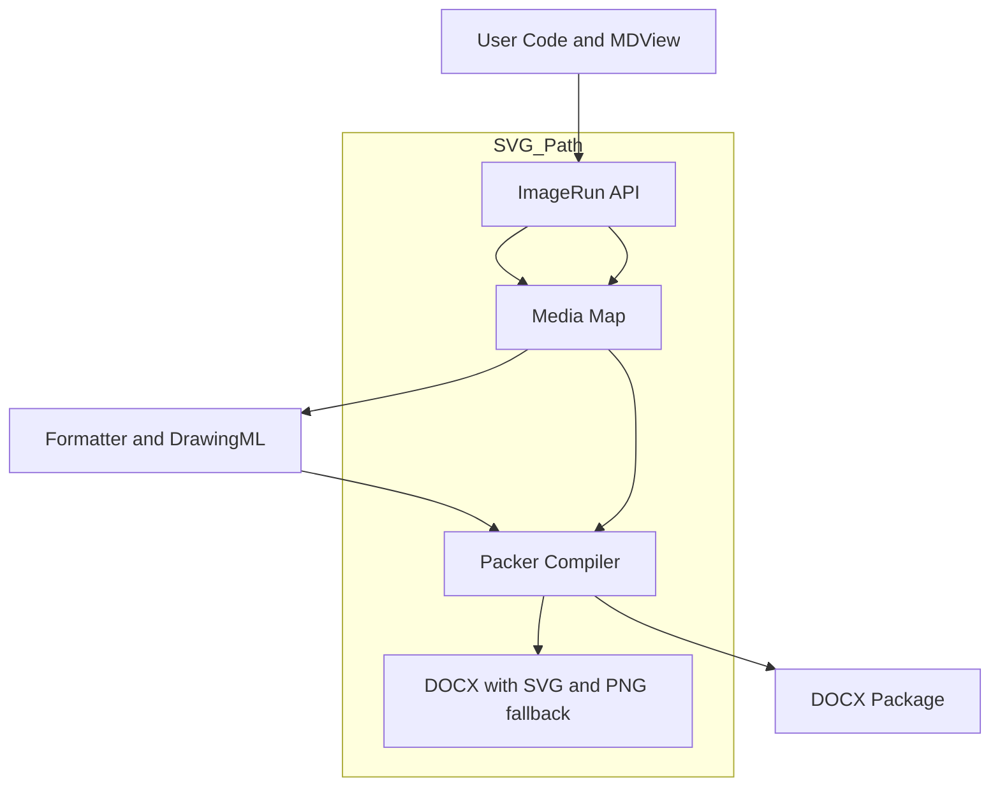
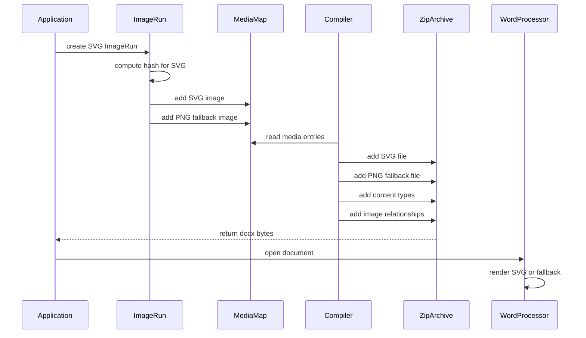

## ARCH-20251202-001: SVG Support Architecture in Forked `docx`

> Status: Draft  
> Author: James Ainslie  
> Created: 2025-12-02  
> Related RFC: `RFC-20251202-001-docx-svg-support.md`

---

### 1. Overview

This architecture document describes how SVG image support is implemented in the forked `docx` library used by MDView and other consumers.

The design:

- Extends the existing image/media pipeline to treat SVG as a first-class image type.
- Preserves the upstream `docx` public API and runtime behaviour for raster images.
- Adds a minimal, well-typed surface for SVG usage and optional raster fallbacks.

---

### 2. Current Image Pipeline

#### 2.1 `ImageRun` and media data

`ImageRun` is responsible for:

- Normalising image input (data URIs, `Buffer`, `Uint8Array`, etc.).
- Computing a deterministic file name based on image content (via `hashedId`).
- Creating a `Drawing` node that will eventually become a `<w:drawing>` with `<a:blip>`.
- Registering image metadata with the `Media` collection during `prepForXml`.

Key implementation:

- `src/file/paragraph/run/image-run.ts`

Responsibilities:

- Maintain a single source of truth (`IMediaData`) describing each image:
  - `type` (e.g. `"png"`, `"jpeg"`, `"gif"`, `"bmp"`, `"svg"`).
  - `data` (binary payload).
  - `fileName` (e.g. `abcd1234.png`).
  - `transformation` (width/height, rotation, flips).

#### 2.2 `Media` collection

- `src/file/media/media.ts`
- Holds a `Map<string, IMediaData>` keyed by file name.
- Provides:
  - `addImage(key: string, mediaData: IMediaData): void`
  - `get Array(): readonly IMediaData[]`

This map is the authoritative registry of media parts that will be emitted into the DOCX package.

#### 2.3 Packer and relationships

- `src/export/packer/next-compiler.ts`
  - Formats the document, headers, footers, comments, etc. into XML strings.
  - Uses `ImageReplacer` to detect where images appear in XML and associates them with `Media` entries.
  - Writes:
    - Content parts (e.g. `word/document.xml`, `word/headerX.xml`).
    - Relationship parts (e.g. `word/_rels/document.xml.rels`) linking to `media/fileName`.
    - Binary media payloads (`word/media/fileName`).
    - Font tables and other auxiliary parts.

#### 2.4 Content types

- `src/file/content-types/content-types.ts`
  - Defines default content types and overrides in `[Content_Types].xml`.
  - Includes entries for raster formats and `image/svg+xml` (for SVG).

---

### 3. SVG-Specific Architecture

SVG support is layered on top of the existing image pipeline with explicit modelling of:

- An SVG primary image.
- An optional raster fallback (PNG/JPEG/GIF/BMP).

#### 3.1 Types and options

At the `ImageRun` layer:

- **Core options**:
  - `CoreImageOptions`:
    - `transformation: IMediaTransformation`
    - `floating?: IFloating`
    - `altText?: DocPropertiesOptions`
    - `outline?: OutlineOptions`

- **Raster image options**:
  - `RegularImageOptions`:
    - `type: "jpg" | "png" | "gif" | "bmp"`
    - `data: Buffer | string | Uint8Array | ArrayBuffer`

- **SVG image options**:
  - `SvgMediaOptions`:
    - `type: "svg"`
    - `data: Buffer | string | Uint8Array | ArrayBuffer`
    - `fallback: RegularImageOptions`

- **Unified public type**:
  - `IImageOptions = (RegularImageOptions | SvgMediaOptions) & CoreImageOptions`

This preserves upstream raster semantics while explicitly modelling SVG and its fallback within the type system.

#### 3.2 `IMediaData` extensions

`IMediaData` is extended to support two shapes:

- **Raster media**:
  - `type: "jpg" | "png" | "gif" | "bmp"`
  - `data`, `fileName`, `transformation`

- **SVG media with fallback**:
  - `type: "svg"`
  - `data` and `fileName` for the SVG part.
  - `fallback`: a nested `IMediaData` instance representing the raster fallback (PNG/JPEG/GIF/BMP).

The `Media` map stores these entries without any special casing; consumers (e.g. `Compiler`) inspect `data.type` to decide how many parts to emit.

---

### 4. Data Flow for SVG Images

Key points:

- Both the SVG and fallback payloads are present in the package.
- Relationship creation and `<a:blip>` usage remain consistent with raster images.
- Consumers can rely on Word’s own rendering and compatibility behaviour.

---

### 5. Component Responsibilities

#### 5.1 `ImageRun`

Location:

- `src/file/paragraph/run/image-run.ts`

Responsibilities:

- Accepts `IImageOptions` which may represent:
  - Raster-only images.
  - SVG with raster fallback.
- Normalises `data` via:
  - `convertDataURIToBinary` (for data URIs) and `standardizeData`.
- Computes a stable `fileName`:
  - `hashedId(options.data)` and `hashedId(options.fallback.data)` for SVG fallback.
- Builds `IMediaData`:
  - For raster-only images: single `IMediaData`.
  - For SVG: primary `IMediaData` plus nested `fallback`.
- Registers media with `Media` in `prepForXml`:
  - Always `addImage(primary.fileName, primary)`.
  - For SVG: additionally `addImage(fallback.fileName, fallback)`.
- Constructs an associated `Drawing` node with:
  - `floating`, `altText`, and `outline` options.

This keeps SVG handling local to the `ImageRun` abstraction and ensures that downstream consumers see a consistent `IMediaData` shape.

#### 5.2 `Media`

Location:

- `src/file/media/media.ts`

Responsibilities:

- Remains a thin registry over `IMediaData` instances.
- Treats SVG and raster entries uniformly.
- Provides `Array` for packer and image replacer components to iterate over.

No SVG-specific logic is required here; it is entirely data-driven.

#### 5.3 Packer `Compiler`

Location:

- `src/export/packer/next-compiler.ts`

Responsibilities:

- Serialise XML components to strings.
- Use `ImageReplacer` to:
  - Discover images referenced in the XML.
  - Associate them with `Media` entries by `fileName`.
- Write media parts:
  - For `data.type !== "svg"`:
    - `zip.file("word/media/" + data.fileName, data.data)`.
  - For `data.type === "svg"`:
    - `zip.file("word/media/" + data.fileName, data.data)` (SVG primary).
    - `zip.file("word/media/" + data.fallback.fileName, data.fallback.data)` (raster fallback).
- Generate relationships:
  - Use `imageReplacer.getMediaData(...)` to gather media references in each XML section.
  - For each media reference, create an image relationship pointing to `media/${mediaData.fileName}`.
  - The same mechanism works for both SVG and raster (the fallback has its own `fileName` and thus its own relationship).

The compiler is intentionally agnostic about the internal structure of `IMediaData` beyond inspecting `type` to decide whether to emit one or two binary parts.

#### 5.4 Content Types

Location:

- `src/file/content-types/content-types.ts`

Responsibilities:

- Register default content types in `[Content_Types].xml`, including:
  - `image/png`, `image/jpeg`, `image/bmp`, `image/gif`.
  - `image/svg+xml` for `.svg` parts.
- Define overrides for core WordprocessingML parts (document, styles, numbers, headers, footers, etc.).

SVG support is activated at the package level by:

- Adding `new Default("image/svg+xml", "svg")` to the `ContentTypes` constructor.

---

### 6. Public API and Usage

#### 6.1 Raster images (unchanged)

Existing usage continues to work:

- Callers construct `ImageRun` with raster options:
  - `type: "png" | "jpeg" | "gif" | "bmp"`.
  - `data` as `Buffer`/`Uint8Array`/`ArrayBuffer`/data URI.
  - `transformation` for width/height and optional rotation/flip.

There is no need for call sites to change when not using SVG.

#### 6.2 SVG with fallback

For SVG images, callers:

- Supply:
  - `type: "svg"`.
  - `data` containing the SVG payload.
  - `fallback` containing a raster representation (e.g. PNG) with its own `type` and `data`.
  - `transformation` controlling layout (shared between primary and fallback).

This matches the RFC requirement to:

- Support SVG as a first-class media type.
- Optionally provide a raster fallback for legacy or non-compliant viewers.

---

### 7. Error Handling and Validation

Key decisions:

- **Opaque SVG handling**:
  - SVG data is treated as opaque bytes.
  - No attempt is made to parse, validate, or sanitise SVG content within the library.
  - This keeps the implementation minimal and delegates rendering/security to Word.

- **Data normalisation**:
  - Invalid base64 or malformed data URIs may cause conversion to fail or produce invalid images.
  - Such errors will surface at document generation time or when Word attempts to render the image.

- **Fallback integrity**:
  - If `type: "svg"` is provided but `fallback` is missing or invalid, behaviour is undefined; callers must supply a valid fallback when required by downstream viewers.

Future enhancements (if needed) could include:

- Runtime assertions for the presence of a fallback when `type: "svg"`.
- More descriptive errors when image registration or packaging fails.

---

### 8. Testing Strategy (Architecture Level)

The test strategy follows the RFC but is framed here in terms of architectural coverage.

#### 8.1 Unit tests

- `ImageRun`:
  - Construct with raster options and assert:
    - A single `IMediaData` with correct type, file name suffix, and transformation.
  - Construct with SVG options and assert:
    - Primary `IMediaData` has `type: "svg"` and `.svg` extension.
    - `fallback` is present with raster `type` and correct file name.
    - `prepForXml` registers both primary and fallback images in `Media`.

- `Media`:
  - Adding multiple images with identical data but different types results in distinct entries.
  - `Array` returns all registered entries, including SVG and fallback.

- `ContentTypes`:
  - Asserts that the generated XML includes defaults for:
    - `image/png`, `image/jpeg`, `image/bmp`, `image/gif`, `image/svg+xml`.

#### 8.2 Integration tests

- End-to-end DOCX generation:
  - Generate a document with:
    - Only raster images.
    - Only SVG images (with fallbacks).
    - Mixed SVG and raster images.
  - Unzip the resulting `.docx` and assert:
    - Presence of `word/media/imageN.svg` for SVG entries.
    - Presence of corresponding fallback media parts (e.g. `word/media/imageM.png`).
    - `[Content_Types].xml` contains `Default` for `image/svg+xml`.
    - Relationships target the correct media paths.

#### 8.3 Behavioural verification

- Manual or automated validation in:
  - Word 2019+ / Microsoft 365 on Windows and macOS.
  - Selected alternative viewers (e.g. LibreOffice) on a best-effort basis.
- Scenarios:
  - Single-page documents with one SVG and fallback.
  - Multi-page documents with multiple SVGs and interleaved raster images.

---

### 9. Backward Compatibility and Migration

#### 9.1 Backward compatibility

- Existing `ImageRun` usages that specify raster `type` values remain valid.
- No changes are required for non-SVG call sites.
- Package structure for raster-only documents is unchanged.

#### 9.2 Migration guidance

For consumers wishing to adopt SVG:

- Replace or supplement raster pathways with `ImageRun` constructed using:
  - `type: "svg"`.
  - `data` as SVG bytes or encoded string.
  - `fallback` with PNG/JPEG/GIF/BMP.
- Verify:
  - Visual rendering in Word for both SVG and fallback scenarios.
  - Package structure via unzip-based assertions where appropriate.

---

### 10. Future Extensions

Potential extensions that fit naturally into this architecture:

- **Automatic raster fallback generation**:
  - Integrate with a rendering pipeline (e.g. headless browser or SVG rasteriser) to auto-generate fallback PNGs when only SVG is provided.

- **Richer configuration**:
  - Per-document or per-image hints for preferred display mode when both SVG and fallback are available.

- **Additional vector formats**:
  - Extend `IImageOptions` and `IMediaData` to support other vector formats if Word and OOXML semantics permit.

All such extensions would reuse the same core pattern:

- Extend `IMediaData` to describe the additional formats.
- Register them in `Media`.
- Emit appropriate parts and content types through the `Compiler`.

